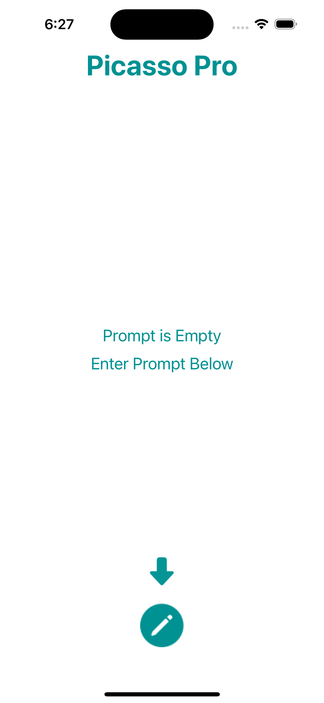
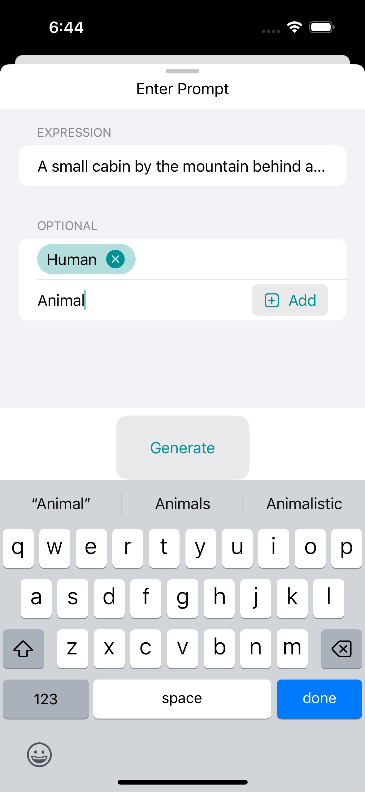
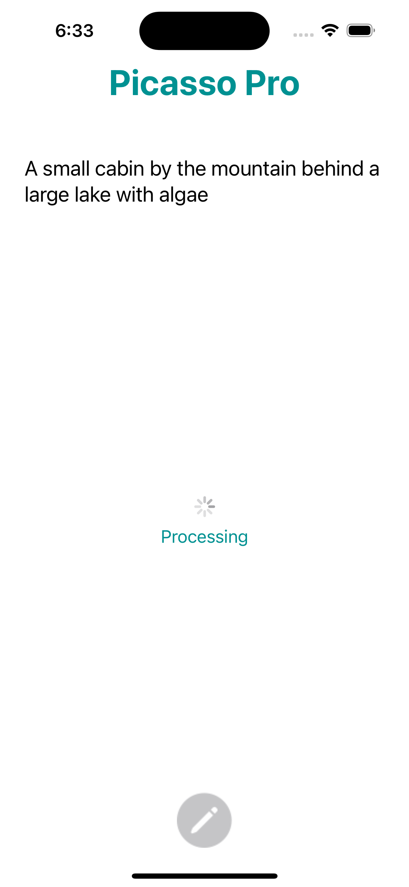
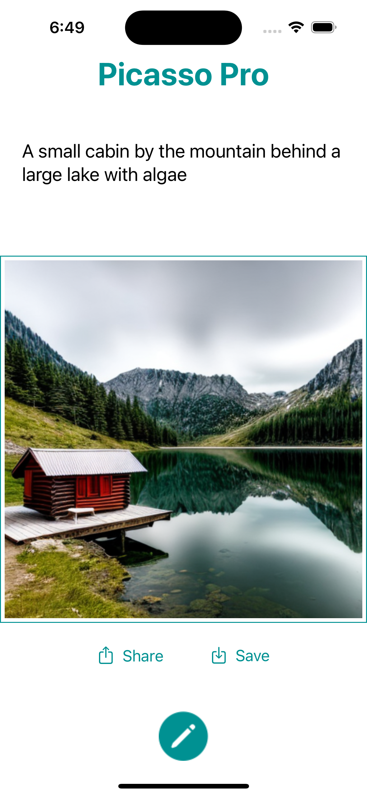
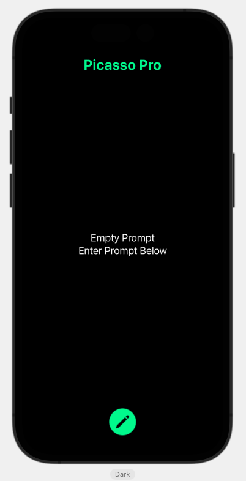
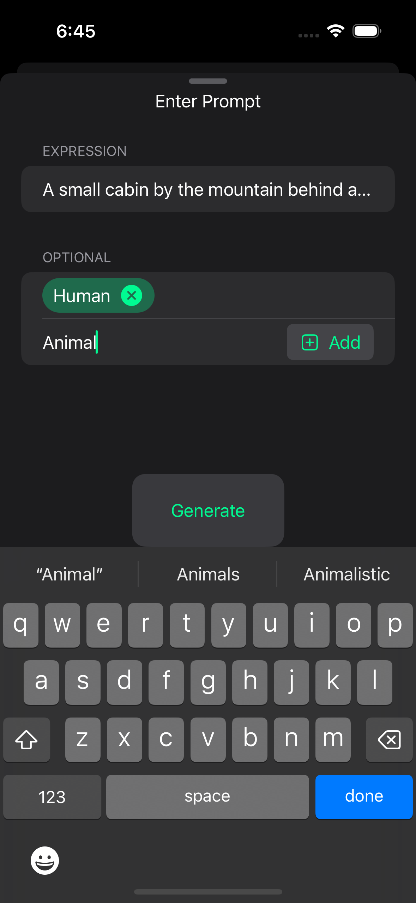
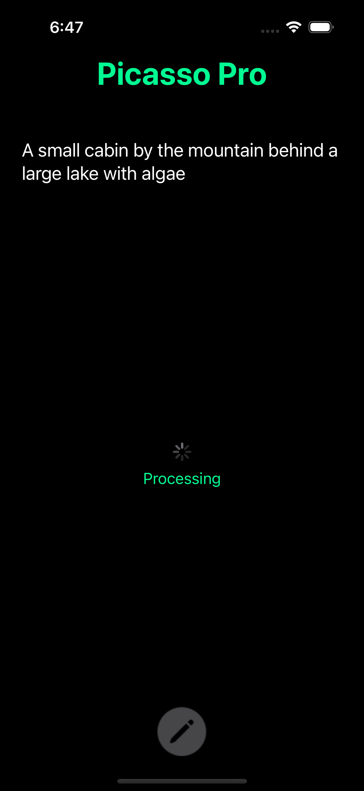
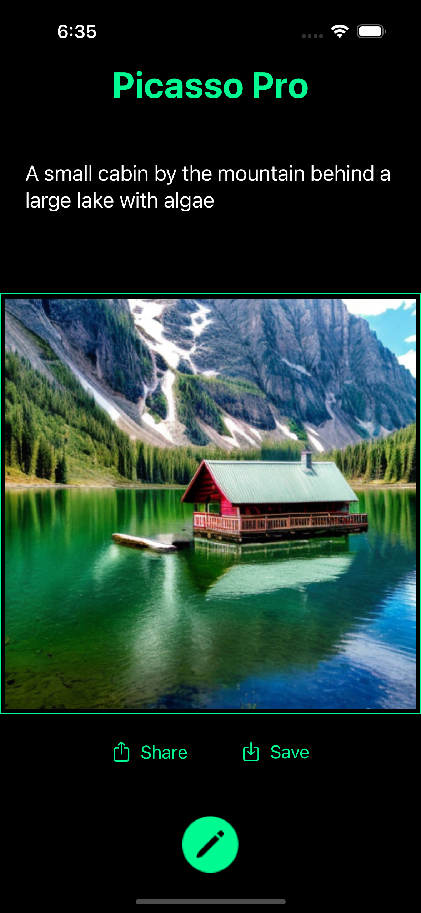

# PicassoPro
An iOS app that generates images from text prompts utilizing Stable Diffusion API. Generated images can be shared or save to the gallery

# Screenshots
## Light Appearance

## Dark Appearance

# Note
A free trial API key is being used in the project which may expire at any time. This will make the app to stop working.
