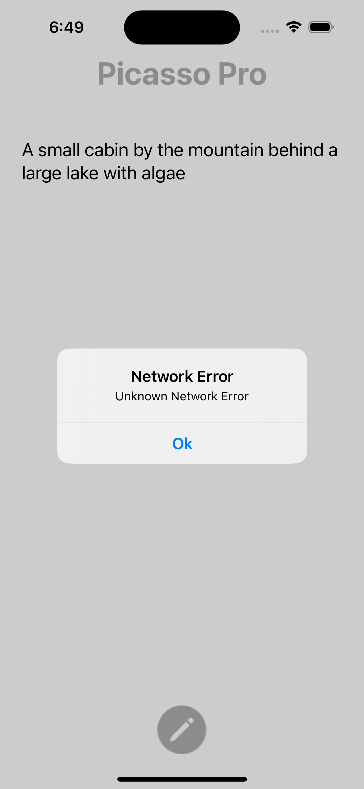
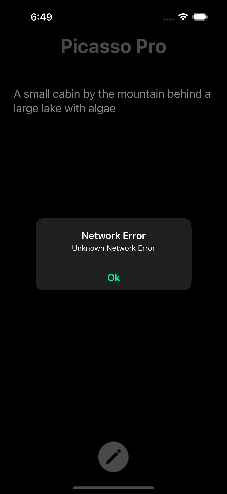

# PicassoPro
An iOS app that generates images from text prompts utilizing StableDiffusionAPI. Generated images can be shared or saved to the gallery.

# Screenshots

## Landing Page

  
&nbsp;
  

## Prompt Input

  
&nbsp;
  

## Processing Page

  
&nbsp;
  

## Output Page

  
&nbsp;
  

## Alert Dialog

  
&nbsp;
  

# Note
A free trial API key is being used in the project which may expire at any time. This will make the app to stop working.
